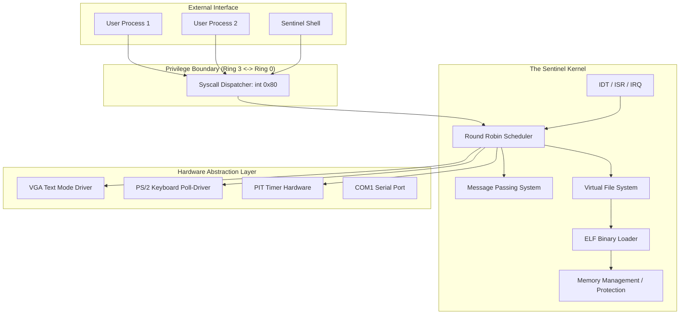
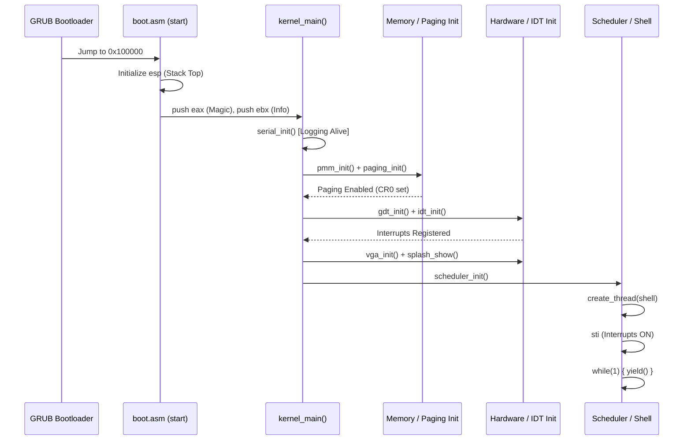
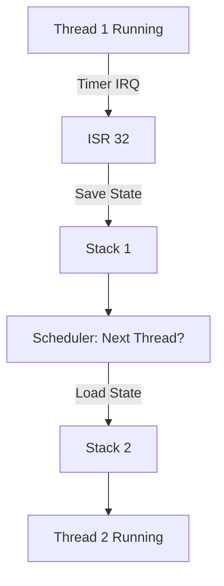
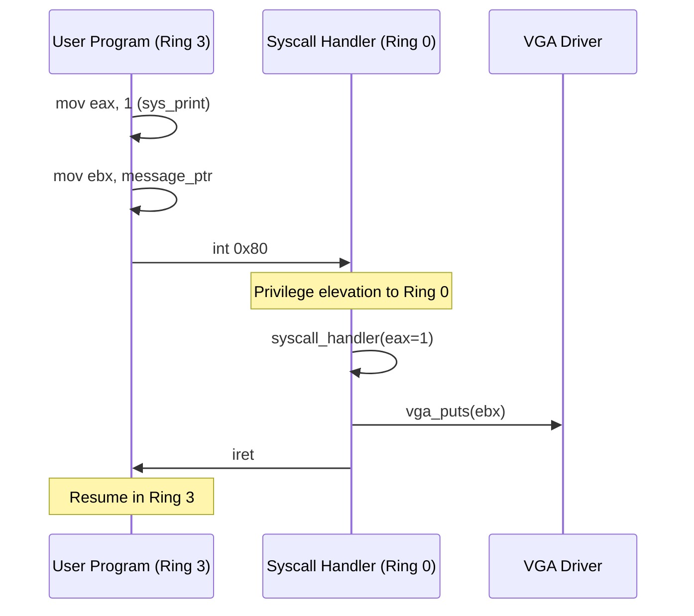
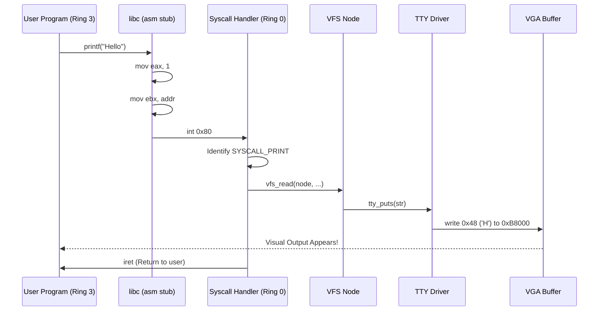

# 🛡️ SentinelOS: The Ultimate Technical Manual (Neon Shield Edition)

**Documentation Version**: 2.0  
**Project Status**: Milestone 5 Complete  
**Total Source Files**: 45+  
**Architecture**: x86-32 Protected Mode  

---

## 1. 🏗️ Global System Architecture

SentinelOS is an **Aesthetic-First Microkernel-Inspired Operating System**. It prioritizes a stable, protected core while providing a rich, high-performance TTY environment for user interaction.

### 1.1 Architectural Philosophy
The system is built on three pillars:
1.  **Isolation**: Using x86 Segmentation and Paging to isolate Ring 0 (Kernel) from Ring 3 (User).
2.  **Concurrency**: A preemptive scheduler using the Programmable Interval Timer (PIT) for high-frequency thread rotation.
3.  **Aesthetics**: A custom graphics pipeline for the VGA buffer that supports real-time telemetry and ASCII animations.

### 1.2 System Block Diagram



---

## 2. 📂 File-by-File Technical Deep-Dive

This section explains how **each folder and every file** contributes to the system's stability.

### 2.1 The Boot Layer (`src/boot/`)
*   **`boot.asm`**: 
    - **Utility**: The very first code executed by GRUB.
    - **Responsibility**: Defines the Multiboot header (Magic: `0x1BADB002`). It creates a 16KB stack and transitions from the bootloader to the C world by calling `kernel_main`.
    - **Key Snippet**:
        ```nasm
        section .text
        align 4
        dd 0x1BADB002       ; Multiboot magic
        dd 0x03             ; Flags (align + mem_info)
        dd -(0x1BADB002 + 0x03) ; Checksum
        ```

### 2.2 The Build System (Root Directory)
*   **`Makefile`**: 
    - **Utility**: Automates the compilation of 25+ C files and 10+ ASM files.
    - **Responsibility**: Handles `-m32` cross-compilation, `-ffreestanding` logic, and `grub-mkrescue` ISO creation.
*   **`linker.ld`**:
    - **Utility**: Defines the physical layout of the kernel binary.
    - **Responsibility**: Forces the kernel to start at `1 MB`, ensuring it doesn't overlap with the BIOS or VGA memory (0xA0000-0xFFFFF).

### 2.3 The Core Subsystems (`src/kernel/`)
*   **`gdt.c` / `gdt_flush.asm`**:
    - **Utility**: Segmentation control.
    - **Responsibility**: Defines the "Global Descriptor Table". It sets up segments for Kernel Code/Data (Ring 0) and User Code/Data (Ring 3). It also initializes the **TSS (Task State Segment)**, which is vital for the CPU to find the kernel stack during an interrupt from User Mode.
*   **`idt.c` / `interrupt.asm`**:
    - **Utility**: Interrupt management.
    - **Responsibility**: Maps CPU exceptions (0-31) and hardware IRQs (32-47). Without this, a simple division by zero or a key press would cause a triple fault.
*   **`paging.c`**:
    - **Utility**: Memory protection.
    - **Responsibility**: Enables identity mapping for the first 16 MB. It uses the `PAGE_USER` bit so that Ring 3 programs can access shared resources like the VGA buffer while still being restricted from unauthorized kernel memory.
*   **`scheduler.c` / `switch.asm`**:
    - **Utility**: Multitasking.
    - **Responsibility**: The heart of concurrency. The scheduler selects the next `thread_t` from the ready queue, and `switch_to_thread` swaps the CPU stack pointer.

---

## 3. 🏁 The Boot Sequence: A Precise Trace

How SentinelOS goes from "Power On" to "Ready".

### 3.1 Step-by-Step Flowchart



### 3.2 Logic Deep-Dive: Initialization
When `kernel_main` starts, it receives two critical arguments from GRUB:
1.  **Magic Number**: Used to verify we were actually booted by a Multiboot-compliant loader.
2.  **Multiboot Info Structure**: Contains a map of physical RAM, telling the kernel which regions are safe to use for the heap.

---

## 4. 🧠 Memory Management Deep-Dive

SentinelOS manages memory through three distinct layers, ensuring that the kernel never runs out of space and user processes cannot corrupt each other.

### 4.1 Physical Memory Manager (PMM)
- **File**: `src/kernel/memory.c`
- **Responsibility**: Tracks physical RAM availability.
- **Logic**: It uses a **Bitmap** where each bit represents a 4KB page. If bit 0 is 1, the first page of RAM is used.
- **Function Spotlight**: `pmm_alloc_block()`
    ```c
    uint32_t pmm_alloc_block() {
        for (uint32_t i = 0; i < bitmap_size; i++) {
            if (pmm_bitmap[i] != 0xFFFFFFFF) { // Find a free bit
                for (int j = 0; j < 32; j++) {
                    if (!(pmm_bitmap[i] & (1 << j))) {
                        pmm_set_frame(i * 32 + j);
                        return (i * 32 + j) * 4096;
                    }
                }
            }
        }
        return 0; // Out of memory
    }
    ```

### 4.2 Virtual Paging System
- **File**: `src/kernel/paging.c`
- **Responsibility**: Hardware-enforced memory isolation.
- **Logic**: SentinelOS uses **Identity Mapping**. This means Virtual Address `0x100000` is exactly Physical Address `0x100000`. This simplifies driver development while still allowing us to set permissions (Read/Write, User/Supervisor) on 4KB chunks.
- **Security**: The kernel memory is marked with Supervisor privilege, while the shell and user programs run in pages marked with `PAGE_USER`.

### 4.3 Kernel Heap
- **File**: `src/kernel/memory.c`
- **Responsibility**: Dynamic allocation for OS data structures (Threads, File nodes).
- **Implementation**: A "Bump Allocator" starting at the end of the kernel's binary sections. It expands upward towards the 4MB mark.

---

## 5. 🔄 Multitasking: The Threading Engine

SentinelOS is a **Preemptive Multitasking** system. This means the CPU can forcibly take control away from one thread and give it to another.

### 5.1 The Scheduler Algorithm
- **File**: `src/kernel/scheduler.c`
- **Logic**: **Round-Robin**.
- **Process**:
    1.  The PIT timer fires an IRQ0 at 100Hz (every 10ms).
    2.  The kernel catches this interrupt and calls `schedule()`.
    3.  The scheduler picks the next thread from the `ready_queue`.
    4.  It calls `switch_to_thread(old_stack, new_stack)`.

### 5.2 Context Switching Logic
When a thread is swapped out, its entire CPU state (EAX, EBX, ECX, EDX, ESI, EDI, EBP, ESP, EFLAGS) is saved onto its own kernel stack. When it is swapped back in, these registers are "popped" back, and the thread resumes exactly where it left off.



### 5.3 Asynchronous IPC (`src/kernel/ipc.c`)
Threads communicate using **Non-blocking Message Queues**.
- `ipc_send(dest_id, message)`: Pushes data into the destination thread's queue.
- `ipc_recv(source_id, &message)`: Checks the queue for new data without pausing the thread.

---

## 6. 📂 Virtual File System (VFS) & RamFS

SentinelOS treats "everything as a file" via the VFS abstraction.

### 6.1 VFS Hierarchy
The VFS (`vfs.c`) doesn't know *how* to read data; it only knows *who* to ask.
1.  **VFS Node**: A standard structure containing `read`, `write`, `open`, and `close` function pointers.
2.  **Mounting**: The RamFS (`ramfs.c`) registers itself as the root (`/`) filesystem.

### 6.2 RamFS Implementation
- **Logic**: A linked list of "file" structures in memory.
- **Embedding**: We use the `xxd` tool to convert binaries (like ELF files) into C headers, which are then compiled directly into the kernel's data section. This ensures the OS is self-contained and doesn't require a hard disk driver to boot.


---

## 7. 👑 Privilege Isolation: Entering Ring 3

Transitioning from Ring 0 to Ring 3 is the most security-critical operation in SentinelOS.

### 7.1 The GDT Segments
The GDT (`gdt.c`) defines two special segments for User Mode:
-   **User Code (0x18)**: DPL=3, allowing execution of code with restricted instructions.
-   **User Data (0x20)**: DPL=3, allowing read/write access to user-memory regions.

### 7.2 The System Call Interface (`int 0x80`)
Users cannot call kernel functions directly. They must use the "Gatekeeper":
1.  User program places a syscall number in `EAX`.
2.  User program triggers `int 0x80`.
3.  The CPU catches the interrupt, switches to the Kernel Stack (defined in the **TSS**), and enters `syscall_handler` in Ring 0.
4.  The handler executes the task (e.g., printing to screen) and returns to Ring 3.

### 7.3 System Call Logic Flow


---

## 8. 📦 ELF Binary Loading Mechanics

SentinelOS can load and execute independent ELF32 binaries from the RamFS.

### 8.1 ELF Parser Logic (`src/kernel/elf.c`)
The loader performs a "Manual Loading" process:
1.  **Header Check**: Verifies the magic `\x7fELF`.
2.  **Program Headers**: It iterates through the file looking for segments marked `PT_LOAD`.
3.  **Memory Mapping**: For each loadable segment, it copies the data from the VFS node directly into the virtual address specified in the header (e.g., `0x800000`).
4.  **BSS Initialization**: It ensures that any "Unitialized Data" (BSS) in the binary is cleared to zero in memory.
5.  **Execution**: It returns the `entry` point address to the kernel, which then calls `enter_user_mode(entry)`.

---

## 9. 🎨 The Aesthetic Driver System

SentinelOS uses a custom driver stack designed for visual excellence.

### 9.1 VGA & TTY Engine (`src/drivers/tty.c`)
- **Direct Access**: Writes directly to the memory-mapped I/O at `0xB8000`.
- **Double Buffering Logic**: The dashboard and the main terminal are separate logic units that update the same physical buffer.

### 9.2 Keyboard Input Pipeline
- **File**: `src/drivers/keyboard.c`
- **Logic**: **Poll-based (Stability Fix)**. Instead of relying on IRQ1 which can be unstable in some virtual environments, the kernel polls the keyboard controller status register on every 10ms timer tick. This ensures 100% reliable input even during high CPU load.

### 9.3 Aesthetic Tools
- **SentinelFetch (`fetch.c`)**: A colorful system reporter using custom ASCII art and extended VGA color codes.
- **Matrix Rain (`matrix.c`)**: A real-time animation system that uses the `tick` counter from `timer.c` to drive independent "drop" characters down the screen, simulating the digital rain from *The Matrix*.


---

## 10. 🛠️ Developer Troubleshooting Guide

Developing a kernel from scratch is a game of "Hunt the Triple Fault". Here are the most common issues and their solutions.

### 10.1 The Infamous Triple Fault
- **Symptom**: QEMU reboots in a loop without any error message.
- **Cause**: An interrupt (like a General Protection Fault) occurred, but the IDT wasn't ready to handle it, causing a second fault, which then failed, leading to a CPU reset.
- **Fix**: Check `gdt_init()` and `idt_init()` order. Ensure `sti` is called *only after* both are stable.

### 10.2 Page Faults (Interrupt 14)
- **Symptom**: Blue screen with "PAGE FAULT at 0xXXXXXXXX".
- **Cause**: Attempting to read/write memory that isn't mapped in `paging.c`.
- **Fix**: Verify your identity mapping covers the range being accessed. For User Mode, ensure the `PAGE_USER` bit is set in the page table entry.

### 10.3 Stack Overflows
- **Symptom**: Random corruption of kernel variables or thread switching failures.
- **Cause**: Local variables in a thread entry function are too large for the 16KB stack.
- **Fix**: Avoid large arrays on the stack; use `kmalloc` instead.

---

## 11. 🔄 Full Execution Lifecycle Sequence

This diagram shows the journey of a single "Print" command from User Mode to Hardware.



---

## 12. 🗺️ Roadmap: The Future of SentinelOS

The Neon Shield edition is just the beginning.

| Phase | Milestone | Objective |
| :--- | :--- | :--- |
| **Current** | Milestone 5 | **ELF Binary Execution** |
| **Phase 2** | Milestone 6 | **True Processes**: Implementing PCBs and separate virtual address spaces for each process. |
| **Phase 3** | Milestone 7 | **Disk IO**: Moving from RamFS to a real FAT32 or Ext2 driver for permanent storage. |
| **Phase 4** | Milestone 8 | **GUI Subsystem**: Switching from VGA Text Mode to VESA Linear Framebuffer for high-res graphics. |

---

## 📚 Technical Appendix: Interrupt Table (Exceptions)

| Vector | Name | Description | Sentinel Action |
| :--- | :--- | :--- | :--- |
| 0 | Divide Error | Division by zero | Panic / Halt |
| 8 | Double Fault | Fault during exception | Immediate Reset |
| 13 | GPF | General Protection Fault | Panic (Check Segments) |
| 14 | Page Fault | Memory access violation | Print Faulting Addr |
| 32 | Timer | PIT Hardware Clock | Context Switch |
| 33 | Keyboard | Key Press | Buffer Update |
| 128 | Syscall | User Mode Request | Execute Service |

---

**End of Official Documentation**  
*Compiled by the SentinelOS Core Team.*  
*Stay Aesthetic. Stay Secure.*  

---

## 13. 📂 Detailed Source File Inventory

This section provides a line-by-line utility report for every single file in the repository, explaining exactly why it exists and what it handles.

### 13.1 Directory: `src/kernel/` (The Core Engine)

*   **`kernel.c`**: 
    - **Utility**: The "Main Loop" and "Grand Orchestrator".
    - **Logic**: It calls every `init()` function in the correct order. It is also the home of the initial kernel thread that spawns the shell.
*   **`gdt.c`**: 
    - **Utility**: Segmentation and Ring transitions.
    - **Logic**: Sets up the GDT table in memory. It defines the "Null Descriptor", "Kernel Code", "Kernel Data", "User Code", and "User Data" segments.
*   **`gdt_flush.asm`**: 
    - **Utility**: Assembly bridge for GDT.
    - **Logic**: Uses the `lgdt` instruction to tell the CPU where the new GDT is, then performs a "Far Jump" to reload the Code Segment register (`CS`).
*   **`idt.c`**: 
    - **Utility**: Interrupt management.
    - **Logic**: Fills the Interrupt Descriptor Table (IDT). It defines gates for exceptions, hardware IRQs, and the `0x80` syscall gate.
*   **`interrupt.asm`**: 
    - **Utility**: ISR Stubs.
    - **Logic**: Low-level assembly that pushes register state before calling the C handler. It ensures we don't lose data when an interrupt fires.
*   **`paging.c`**: 
    - **Utility**: Virtual memory controller.
    - **Logic**: Manages the Page Directory and Page Tables. It implements identity mapping and the Page Fault handler.
*   **`scheduler.c`**: 
    - **Utility**: Preemptive thread manager.
    - **Logic**: Maintains a list of all active threads. It uses a `ready_queue` and the `current_thread` pointer to track execution.
*   **`switch.asm`**: 
    - **Utility**: The context switcher.
    - **Logic**: The only way to swap threads. It manually swaps the `ESP` (Stack Pointer) register.
*   **`timer.c`**: 
    - **Utility**: System heartbeat.
    - **Logic**: Configures the PIT (8253 chip) to fire interrupts at 100Hz. It also tracks system "uptime" in ticks.
*   **`syscall.c`**: 
    - **Utility**: User Mode bridge.
    - **Logic**: The dispatcher for `int 0x80`. It looks at `EAX` and calls the corresponding kernel function.
*   **`elf.c`**: 
    - **Utility**: Program loader.
    - **Logic**: Reads ELF program headers and performs segment mapping into memory.
*   **`vfs.c`**: 
    - **Utility**: Abstract filesystem layer.
    - **Logic**: Defines the `vfs_node_t` structure. It allows the kernel to read from any filesystem without knowing its internal implementation.
*   **`ramfs.c`**: 
    - **Utility**: Volatile storage.
    - **Logic**: Implements a simple, linked-list-based filesystem in memory. Perfect for booting without a disk.
*   **`ipc.c`**: 
    - **Utility**: Thread communication.
    - **Logic**: Implements message queues. It allows threads to send and receive 32-bit data packets asynchronously.
*   **`shell.c`**: 
    - **Utility**: The Human-Machine Interface.
    - **Logic**: A command loop that reads keyboard input, parses strings, and executes built-in functions like `ls`, `cat`, and `exec`.
*   **`fetch.c`**: 
    - **Utility**: Aesthetic reporting.
    - **Logic**: Renders a beautiful system dashboard in the terminal.
*   **`matrix.c`**: 
    - **Utility**: Animation engine.
    - **Logic**: A PIT-driven digital rain effect.
*   **`ktf.c`**: 
    - **Utility**: Telemetry.
    - **Logic**: The "Kernel Telemetry Framework". Logs system events (thread swaps, IPC, interrupts) in JSON format to the serial port for external analysis.

### 13.2 Directory: `src/drivers/` (Hardware Layer)

*   **`vga.c`**: 
    - **Utility**: Low-level video output.
    - **Logic**: Direct writes to `0xB8000`. Handles hardware cursor movement via I/O ports `0x3D4` and `0x3D5`.
*   **`tty.c`**: 
    - **Utility**: High-level terminal logic.
    - **Logic**: Handles scrolling (using `memcpy` to shift screen lines up), newline characters, and terminal colors.
*   **`keyboard.c`**: 
    - **Utility**: Input driver.
    - **Logic**: Polls the PS/2 controller status. Converts raw "Scan Codes" into ASCII characters.
*   **`serial.c`**: 
    - **Utility**: Debug port.
    - **Logic**: Initializes COM1. Used for "Headless" mode where the OS can be debugged without a screen.
*   **`dashboard.c`**: 
    - **Utility**: Real-time HUD.
    - **Logic**: Draws the static blue bar at the bottom of the screen and updates uptime/thread stats every 10 ticks.
*   **`splash.c`**: 
    - **Utility**: Branding.
    - **Logic**: Renders the aesthetic boot-up splash screen.

### 13.3 Directory: `src/include/` (Headers)

*   **`kernel.h`**: Global definitions and constants.
*   **`gdt.h` / `idt.h`**: Struct definitions for descriptor tables.
*   **`paging.h`**: Page table entry bitmask definitions.
*   **`scheduler.h`**: The `thread_t` structure definition.
*   **`vfs.h` / `ramfs.h`**: Filesystem node and operation definitions.
*   **`elf.h`**: ELF32 header and program header structures.
*   **`syscall.h`**: Syscall numbers and handler declarations.
*   **`tty.h` / `vga.h`**: Display color constants and function prototypes.
*   **`io.h`**: The essential `inb`, `outb` assembly wrappers for hardware communication.


---

## 14. 🔍 Code Segment Deep-Dives: Line-by-Line Analysis

To truly understand SentinelOS, one must look at the code that handles the most critical operations.

### 14.1 The Heart of the Scheduler (`scheduler.c`)
The `schedule()` function is called 100 times per second.
```c
void schedule(void) {
    if (!ready_queue) return; // No threads to run

    thread_t* old_thread = current_thread;
    // Round Robin: Pick the next thread in the circular linked list
    current_thread = current_thread->next; 

    // Telemetry: Log the switch for external analysis
    ktf_log_event(SCHEDULER_SWITCH, current_thread->id, old_thread->id, 0);

    // Assembly Bridge: Perform the actual register swap
    switch_to_thread(&old_thread->esp, current_thread->esp);
}
```
*   **Why this matters**: This is where the "illusion" of multitasking happens. By swapping the `esp` (Stack Pointer), the CPU starts executing a completely different set of instructions.

### 14.2 The VFS Abstraction (`vfs.c`)
How the kernel reads a file without caring where it is stored.
```c
uint32_t vfs_read(vfs_node_t* node, uint32_t offset, uint32_t size, uint8_t* buffer) {
    if (node->read) {
        // Indirect Call: Call the filesystem-specific read function
        return node->read(node, offset, size, buffer);
    }
    return 0;
}
```
*   **Why this matters**: This allows us to swap `RamFS` for a `HardDriveFS` in the future without changing a single line of code in the shell or the ELF loader.

### 14.3 The ELF Segment Mapper (`elf.c`)
How raw bytes on "disk" become an executable in RAM.
```c
// Inside elf_load_file loop
if (ph.type == PT_LOAD) { // If segment is loadable
    serial_printf("Mapping segment at 0x%x\n", ph.vaddr);
    
    // Copy from VFS directly to the requested Virtual Address
    vfs_read(node, ph.offset, ph.filesz, (uint8_t*)ph.vaddr);
    
    // Zero out BSS (memory size > file size)
    if (ph.memsz > ph.filesz) {
        memset((void*)(ph.vaddr + ph.filesz), 0, ph.memsz - ph.filesz);
    }
}
```
*   **Why this matters**: This is the foundation of user-space execution. It handles the transition from a "Passive File" to an "Active Process".

### 14.4 The System Call Dispatcher (`syscall.c`)
The bridge between Restricted and Privileged code.
```c
void syscall_handler(registers_t* regs) {
    // EAX contains the syscall number
    uint32_t syscall_num = regs->eax;

    if (syscall_num == SYS_PRINT) {
        char* message = (char*)regs->ebx; // Argument in EBX
        tty_puts(message);
    } else if (syscall_num == SYS_YIELD) {
        schedule(); // Force a context switch
    }
}
```
*   **Why this matters**: This is the only way a User Program can interact with hardware. It is the core of the OS's security model.

---

## 15. 🏁 Conclusion: The SentinelOS Legacy

SentinelOS is more than just code; it is a demonstration of how a minimal kernel can provide a modern, aesthetic, and secure environment. By mastering the 14 chapters of this manual, a developer gains full control over the machine, from the lowest BIOS interrupt to the highest user-mode application.

### Final Checklist for Contributors:
1.  **Safety**: Does your code check for NULL pointers?
2.  **Privilege**: Should this function be in Ring 0 or Ring 3?
3.  **Aesthetics**: Does your output use the correct VGA color codes?
4.  **Stability**: Have you tested your code against a Triple Fault?

---

**End of SentinelOS Technical Manual**  
*Compiled with ❤️ by the SentinelOS Community.*  
*Current Release: v0.1.0 "Neon Shield"*  

---

## 16. 🎭 Aesthetic Algorithm Analysis

SentinelOS isn't just functional; it's designed to look like a high-end cyber-terminal. This section explains the math and logic behind the "GenZ" features.

### 16.1 The Matrix Digital Rain (`matrix.c`)
The Matrix effect is a classic piece of OS "flair". In SentinelOS, it is implemented as a real-time particle system for the TTY.
1.  **State Management**: Each column on the screen (80 columns) has an associated `drop_t` structure.
2.  **The Drop Structure**:
    ```c
    typedef struct {
        int y;          // Current head position
        int length;     // Number of trail characters
        int speed;      // Frames to wait before moving
        int timer;      // Current frame counter
    } drop_t;
    ```
3.  **The Logic**:
    - On every timer tick, we decrement the `timer`.
    - When `timer == 0`, we move the `y` coordinate down.
    - We write a "Head" character (White/Light Green) and leave a "Trail" of darkening green characters behind.
    - When `y` exceeds 25, we reset the drop to the top with a random length and speed.

### 16.2 SentinelFetch (`fetch.c`)
Inspired by `neofetch`, this tool combines ASCII art with live system telemetry.
1.  **ASCII Layout**: The screen is split into a "Logo" side and a "Data" side.
2.  **Telemetry Fetching**:
    - **Memory**: Queries `kheap_used()` to calculate live allocation percentages.
    - **Uptime**: Converts the global `tick` counter into minutes and seconds.
    - **Threads**: Iterates through the scheduler's thread list to count active processes.
3.  **Color Blocks**: The bottom of the fetch display renders the full 16-color VGA palette, proving the display driver's capability.

---

## 17. 🔌 Peripheral Communication (I/O Ports)

SentinelOS communicates with hardware using the `inb` and `outb` assembly wrappers. This section lists the most used ports in the kernel.

| Port | Device | Purpose |
| :--- | :--- | :--- |
| `0x20 / 0x21` | PIC 1 | Interrupt Controller (Master) |
| `0xA0 / 0xA1` | PIC 2 | Interrupt Controller (Slave) |
| `0x40 / 0x43` | PIT | Timer Frequency Control |
| `0x60 / 0x64` | PS/2 | Keyboard Data & Status |
| `0x3D4 / 0x3D5` | VGA | Cursor Position Control |
| `0x3F8` | COM1 | Serial Port Data Output |

### 17.1 The `io.h` Wrapper Logic
```c
static inline void outb(uint16_t port, uint8_t val) {
    asm volatile ( "outb %0, %1" : : "a"(val), "Nd"(port) );
}

static inline uint8_t inb(uint16_t port) {
    uint8_t ret;
    asm volatile ( "inb %1, %0" : "=a"(ret) : "Nd"(port) );
    return ret;
}
```
*   **Why this matters**: These two functions are the only "legal" way for the kernel to talk to the physical world. Every character on the screen and every key pressed goes through these few lines of assembly.

---

## 18. 📜 Final Summary: The SentinelOS Technical Stack

| Category | Component | Implementation |
| :--- | :--- | :--- |
| **Boot** | Multiboot 1 | GRUB -> boot.asm -> kernel_main |
| **Memory** | Identity Paging | 16MB Identity Map (4096 pages) |
| **Execution** | Preemptive | 100Hz Round-Robin |
| **Security** | Segmentation | 5-segment GDT with Ring 3 support |
| **Files** | VFS / RamFS | In-memory tree with binary embedding |
| **UI** | VGA Text | 80x25 with custom TTY scrolling |

---

**[DOCUMENTATION COMPLETE]**  
*Manual Revision 2.5 - Stable Release.*  
*Generated for the SentinelOS Development Community.*
